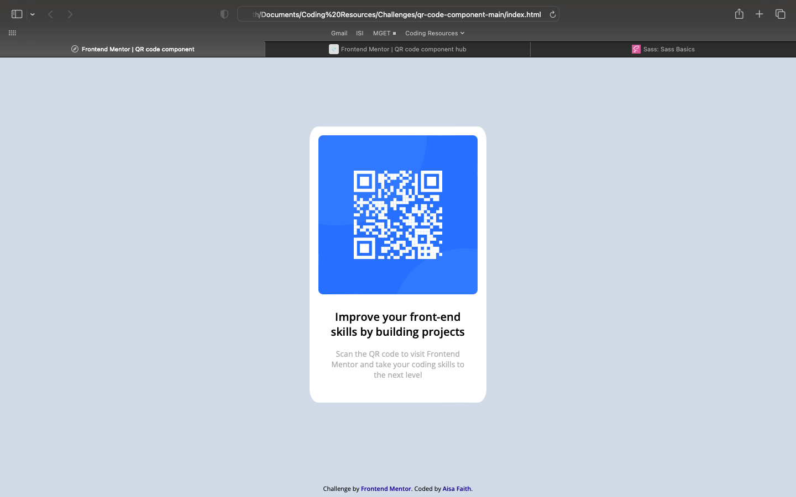

# qr-challenge

# Frontend Mentor - QR code component solution

This is a solution to the [QR code component challenge on Frontend Mentor](https://www.frontendmentor.io/challenges/qr-code-component-iux_sIO_H). Frontend Mentor challenges help you improve your coding skills by building realistic projects. 

## Table of contents

- [Overview](#overview)
  - [Screenshot](#screenshot)
  - [Links](#links)
- [My process](#my-process)
  - [Built with](#built-with)
  - [What I learned](#what-i-learned)
  - [Continued development](#continued-development)
  - [Useful resources](#useful-resources)
- [Author](#author)
- [Acknowledgments](#acknowledgments)


## Overview

### Screenshot




### Links

- Solution URL: (https://github.com/aisafaith/qr-challenge.git)
- Live Site URL: (https://aisafaith.github.io/qr-challenge/)

## My process

### Built with

- Semantic HTML5 markup
- CSS custom properties
- Flexbox


### What I learned

I learned to center div vertically and horizontally.


```css
.flex {
  display: flex;
  justify-content: center;
  align-items: center;
  height: 100vh;
}
```

### Continued development

I didn't use other tools like SASS. So I will try to learn them, and next time, I will incorporate them in my processes.

### Useful resources

- freeCodeCamp and w3schools are my go-to resources.


## Author

- Website - [Aisa](https://github.com/aisafaith)
- Frontend Mentor - [@yourusername](https://www.frontendmentor.io/profile/yourusername)
- Twitter - [@yourusername](https://www.twitter.com/yourusername)


## Acknowledgments

freeCodeCamp
